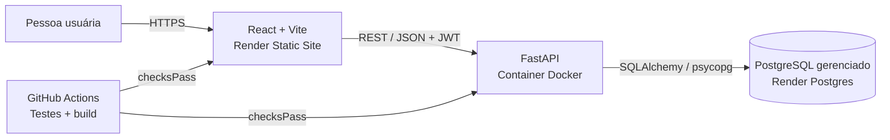

# NuvemTask

Aplicação web para organizar projetos e tarefas em um único espaço. O NuvemTask permite criar uma conta, manter projetos privados, acompanhar o estado de cada tarefa e consultar o progresso do projeto.

> **Trabalho individual:** a proposta da disciplina descreve equipes de 4 a 6 pessoas. Este projeto foi desenvolvido individualmente por Jhonatan Almeida, que acumulou os papéis de arquitetura, back-end, front-end, DevOps, testes e documentação. O relatório identifica essa contribuição individual sem atribuir trabalho a outras pessoas.

## Funcionalidades

- Cadastro e login com senha armazenada por derivação criptográfica e token com expiração.
- Perfis `user` e `admin`; o administrador consulta usuários e projetos.
- Projetos: criar, listar, consultar, editar e excluir.
- Tarefas: criar, listar, consultar, editar status/conteúdo e excluir.
- Validação dos dados no back-end e isolamento dos projetos por proprietário.
- Documentação interativa OpenAPI em `/docs` e especificação JSON em `/openapi.json`.
- Logs de acesso e de exceção com identificador de requisição.
- Front-end responsivo em React; API FastAPI em container Docker.
- PostgreSQL gerenciado fora do container da API na configuração de nuvem.
- Testes automatizados da API e de um fluxo da interface; pipeline GitHub Actions para testar e compilar.

## Arquitetura



O back-end é stateless: sessões ficam fora do processo da API e a persistência fica no PostgreSQL gerenciado. A API usa a conexão interna do Render. No ambiente atual, o painel do banco também permite conexões de entrada de qualquer origem IPv4 (0.0.0.0/0); restrinja essa regra antes de usar dados reais. A capacidade real de escala depende do plano escolhido no provedor.

## Executar localmente

### Opção A — API com SQLite local

Requer Python 3.12+ e Node.js 22+.

```powershell
cd backend
python -m venv .venv
.\.venv\Scripts\Activate.ps1
python -m pip install -r requirements.txt
uvicorn app.main:app --reload
```

Em outro terminal:

```powershell
cd frontend
npm ci
npm run dev
```

Abra `http://localhost:5173`. A API fica em `http://localhost:8000`; Swagger em `http://localhost:8000/docs`. Configure `VITE_API_URL` no ambiente de build do front-end se a API estiver em outro endereço. Para conceder o perfil de administrador, defina `ADMIN_EMAIL` antes de registrar essa conta.

### Opção B — API e PostgreSQL pelo Docker Compose

Na raiz do repositório:

```powershell
docker compose up --build
```

O Compose inicia PostgreSQL e API. Inicie o front-end com `npm ci` e `npm run dev` na pasta `frontend`. O e-mail configurado como administrador nesse ambiente é `admin@nuvemtask.local`.

## Variáveis de ambiente

| Variável | Uso | Exemplo local |
|---|---|---|
| `DATABASE_URL` | Banco local ou conexão com PostgreSQL gerenciado | `sqlite:///./nuvemtask.db` |
| `JWT_SECRET_KEY` | Chave de assinatura dos tokens | Gere uma chave aleatória longa |
| `TOKEN_EXPIRATION_MINUTES` | Duração do token | `60` |
| `ADMIN_EMAIL` | E-mail que recebe perfil admin no cadastro | `admin@exemplo.com` |
| `CORS_ORIGINS` | Origens permitidas, separadas por vírgula | `http://localhost:5173` |
| `VITE_API_URL` | Endereço base da API usado no build do React | `http://localhost:8000` |

`backend/.env.example` e `.env.example` ilustram as configurações. Valores reais de segredo não devem ser commitados. No Render, o blueprint gera `JWT_SECRET_KEY`, solicita `ADMIN_EMAIL` e conecta a API ao Postgres privado.

## Testes e build

```powershell
cd backend
python -m pip install -r requirements.txt
pytest -q
```

```powershell
cd frontend
npm ci
npm test
npm run build
```

O GitHub Actions repete essas etapas em pull requests e pushes para `main` ou `master`. O `render.yaml` configura os serviços para iniciar deploy automático depois que as verificações do branch passarem. A publicação precisa ser ativada ao conectar este repositório a uma conta Render.

## Implantação no Render

1. Crie um repositório público no GitHub e envie este código.
2. No Render, crie um Blueprint a partir do repositório e escolha `render.yaml`.
3. Informe em `ADMIN_EMAIL` o e-mail da conta que terá perfil de administrador.
4. Aguarde a criação do Postgres, da API e do site estático.
5. Confirme as URLs de `nuvemtask-api` e `nuvemtask-web`; ajuste `VITE_API_URL` e `CORS_ORIGINS` se o provedor atribuir outros endereços.
6. Registre a conta admin usando o e-mail configurado; registre outra conta para demonstrar a autorização de usuário comum.
7. Confira `/healthz`, `/docs` e o fluxo completo no front-end. Após conectar o GitHub, os checks do workflow bloqueiam o deploy até o teste e o build passarem.

**Situação da implantação (25/09/2026):** repositório público em https://github.com/jhonatanallmeida/nuvemtask-jhonatan. O front-end está em https://nuvemtask-web.onrender.com; a API está em https://nuvemtask-api.onrender.com, com /healthz respondendo HTTP 200 e documentação em /docs. O PostgreSQL aparece como disponível no Render, no plano gratuito, com expiração informada para 25/10/2026. O CI do commit c3bae6e passou. Em produção, foram validados o cadastro administrativo, a criação de um projeto e a criação de três tarefas; falta cadastrar um usuário comum e conferir o isolamento dos dados entre contas.

## API — rotas principais

| Método | Rota | Acesso | Finalidade |
|---|---|---|---|
| `POST` | `/api/auth/register` | Público | Criar conta e emitir token |
| `POST` | `/api/auth/login` | Público | Autenticar |
| `GET` | `/api/me` | Autenticado | Consultar perfil |
| `GET` | `/api/admin/users` | Admin | Listar usuários |
| `GET`, `POST` | `/api/projects` | Autenticado | Listar e criar projetos |
| `GET`, `PATCH`, `DELETE` | `/api/projects/{id}` | Proprietário ou admin | Consultar, editar e excluir projeto |
| `GET`, `POST` | `/api/projects/{id}/tasks` | Proprietário ou admin | Listar e criar tarefas |
| `GET`, `PATCH`, `DELETE` | `/api/tasks/{id}` | Proprietário ou admin | Consultar, editar e excluir tarefa |

## Estrutura

```text
backend/app/       API, modelos, validação, autenticação e configuração
backend/tests/     Testes automatizados da API
frontend/src/      Aplicação React, estilos e teste de interface
.github/workflows/ CI de API e front-end
render.yaml        API Docker, site estático e Postgres gerenciado
docker-compose.yml Execução local com PostgreSQL
docs/              Relatório técnico e roteiro da demonstração
```
