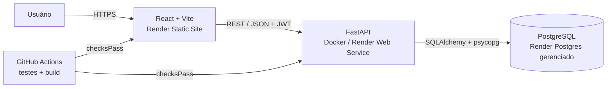

# Relatório técnico NuvemTask

**Curso:** Análise e Desenvolvimento de Sistemas / IA (EAD — Unifor)  
**Atividade:** Desenvolvimento de Software em Nuvem  
**Integrante:** Jhonatan Almeida  
**Data:** setembro de 2026

## 1. Visão geral

O NuvemTask é uma aplicação web para organizar projetos e acompanhar tarefas por status. A pessoa usuária cria uma conta, mantém projetos privados e registra tarefas com descrição, prazo e situação. O perfil administrador pode consultar os usuários e os projetos cadastrados. O sistema foi construído como aplicação em camadas: interface React, API REST FastAPI e banco relacional PostgreSQL gerenciado.

O código inclui os recursos de implantação como infraestrutura declarativa e pipeline de integração contínua. A publicação pública ainda depende de enviar o repositório ao GitHub e conectar o Blueprint a uma conta Render; por isso, URLs de produção e evidências de deploy serão acrescentadas após o provisionamento.

## 2. Arquitetura em nuvem

O front-end e a API são serviços separados. A API não guarda sessão nem dados no filesystem do container; ela valida o token de cada chamada e consulta o banco externo. Esse desenho permite substituir ou ampliar instâncias da API sem mover os registros. O banco é privado e compartilhado pelas instâncias. A configuração atual define uma instância inicial; a escala efetiva depende do plano do provedor.

O modelo relacional possui três entidades: `User` tem vários `Project`, e cada projeto tem várias `Task`. Chaves estrangeiras ligam os registros e a camada da API verifica o proprietário antes de ler ou alterar um projeto ou tarefa. O perfil `admin` tem acesso de consulta ampliado.

## 3. Tecnologias e serviços

| Camada | Tecnologia | Responsabilidade |
|---|---|---|
| Front-end | React 19 e Vite | Login, painel responsivo, CRUD de projetos e tarefas |
| Back-end | FastAPI e SQLAlchemy 2 | API REST, validação, regras de acesso e OpenAPI |
| Autenticação | JWT HS256 e scrypt | Token com expiração e armazenamento de senha por hash com salt |
| Banco de dados | PostgreSQL gerenciado | Persistência externa ao container da aplicação |
| Container | Docker | Empacotar e executar a API |
| CI/CD | GitHub Actions e Render Blueprint | Testar e compilar; deploy automático após checks aprovados |
| Logs | logging do Python | Registrar rota, método, status, duração e erros com ID de requisição |

## 4. Segurança e qualidade

O cadastro não aceita um perfil arbitrário enviado pelo navegador. O endereço definido em `ADMIN_EMAIL` recebe perfil administrativo no cadastro; demais contas são criadas como `user`. As rotas protegidas exigem bearer token assinado e com validade de 60 minutos. A senha é derivada com scrypt e salt aleatório, e nunca é devolvida pela API.

O back-end valida formato e tamanho de dados, aplica autorização por proprietário e limita CORS às origens configuradas. Segredos e a URL do banco são variáveis de ambiente, fora do código versionado. Erros internos retornam mensagem genérica, enquanto o log mantém a exceção para diagnóstico. A documentação OpenAPI está disponível em `/docs`.

Os testes de API cobrem cadastro, login, consulta de perfil, CRUD de projetos e tarefas, validação de entrada, isolamento entre usuários e autorização do administrador. Um teste de interface confirma o fluxo de alternar para o formulário de cadastro. A pipeline executa esses testes e o build do front-end em pushes e pull requests.

## 5. Implantação e CI/CD

O `render.yaml` descreve a API Docker, o front-end estático e o PostgreSQL. A conexão do banco é fornecida ao serviço da API pelo próprio Render. O segredo JWT é gerado pelo provedor; o e-mail do administrador é solicitado na configuração inicial. O front-end recebe `VITE_API_URL` durante o build e a API permite a origem do site por CORS.

O workflow `.github/workflows/ci.yml` instala dependências, executa `pytest`, executa o teste de interface e gera o build Vite. Os serviços Render usam `autoDeployTrigger: checksPass`: depois de conectar o GitHub e o Render, cada deploy do branch conectado aguarda as verificações. A configuração de provisionamento está no repositório; o deploy público e a demonstração em produção ainda precisam ser realizados na conta do integrante.

## 6. Papéis e contribuições

| Papel da proposta | Responsabilidade assumida pelo integrante único |
|---|---|
| Arquitetura em nuvem | Definição das camadas, banco externo, variáveis e blueprint |
| Back-end | Modelos, autenticação, autorização, CRUD, validação e logs |
| Front-end | Interface React, formulários, painel e integração com a API |
| DevOps | Docker, Compose, GitHub Actions e configuração Render |
| Qualidade e testes | Testes automatizados da API e fluxo de cadastro |
| Documentação e integração | README, relatório e roteiro da demonstração |

## 7. Dificuldades e soluções

A proposta pressupõe equipes de quatro a seis pessoas, enquanto esta entrega foi realizada individualmente por Jhonatan Almeida. Para manter rastreabilidade, as responsabilidades foram reunidas em um quadro individual e descritas sem atribuir contribuições inexistentes. Outra decisão foi manter a API stateless e a persistência em serviço separado, para evitar a perda de dados quando um container é recriado. A configuração de nuvem automatiza as conexões e gera o segredo de assinatura, mas a disponibilização pública depende das contas externas e da publicação do repositório.

**Referência técnica:** [Render Blueprint Specification](https://render.com/docs/blueprint-spec), consultada para configurar serviços, banco, variáveis e deploy após verificações.
